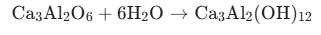
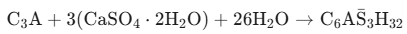
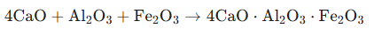

## Theory

Cement is a key ingredient in the construction industry due to its ability to bind materials together, contributing to the strength and durability of concrete structures. Its primary chemical components include calcium, silicon, aluminum, iron, and other minor elements. The determination of these components provides essential information about the cement's quality, which affects its performance in construction applications. The chemical composition of cement directly influences critical properties such as strength, workability, setting time, and durability.

### Cement Composition and the Importance of Each Oxide

Cement is a complex mixture of various compounds primarily composed of oxides that undergo intricate chemical transformations during hydration. Understanding these oxides and their reactions is fundamental to predicting and controlling cement performance. The following is a comprehensive description of each major oxide, its hydration mechanisms, and associated chemical reactions:

### 1. Calcium Oxide (CaO)

- **Most abundant oxide in cement** (typically 60--67% by mass).
- Reacts exothermically with water to form calcium hydroxide, which then participates in the formation of calcium silicate hydrates (C-S-H), the primary binding phase.
- **Primary contributor to strength development** through C-S-H gel formation.
- Excess free CaO (free lime) may lead to delayed expansive reactions, causing cracking and affecting long-term durability.
- The $\text{CaO/SiO}_2$ ratio is a critical parameter in determining cement reactivity and strength characteristics.

**Key Reactions:**

Hydration of CaO:

$$
\text{CaO} + \text{H}_2\text{O} \rightarrow \text{Ca(OH)}_2 + \text{Heat} \quad (\Delta H = -65.2~\text{kJ/mol})
$$

Formation of C-S-H (in presence of silicates):

$$
\text{Ca(OH)}_2 + \text{SiO}_2 \rightarrow \text{C-S-H (calcium silicate hydrate gel)}
$$

Alternative representation:

$$
3\text{CaO}\cdot\text{SiO}_2 + (n+3)\text{H}_2\text{O} \rightarrow \text{C}_x\text{S}_y\text{H}_z \;(\text{C-S-H gel}) + (3-x)\text{Ca(OH)}_2
$$

### 2. Silicon Dioxide (SiO₂)

- **Second most abundant oxide** (typically 17--25% by mass).
- Reacts with CaO to form C-S-H, the main binding phase responsible for cement strength and cohesion.
- Enhances long-term strength development and resistance to chemical attack.
- Balanced SiO₂ content ensures proper setting time, workability, and durability.
- Higher silica content generally improves later-age strength and reduces permeability.

**Key Reactions:**

Formation of calcium silicate hydrates:

$$
2\text{CaO} + \text{SiO}_2 + \text{H}_2\text{O} \rightarrow \text{C}_3\text{S}_2\text{H}_3 \;(\text{C-S-H gel})
$$

Hydration of dicalcium silicate (belite):

$$
2\text{CaO}\cdot\text{SiO}_2 + x\text{H}_2\text{O} \rightarrow \text{C}_x\text{S}_y\text{H}_z + \text{Ca(OH)}_2
$$

Pozzolanic reaction (long-term):

$$
\text{Ca(OH)}_2 + \text{SiO}_2 + \text{H}_2\text{O} \rightarrow \text{C-S-H (secondary strength gain)}
$$

### 3. Aluminum Oxide (Al₂O₃)

- Typically comprises 3--8% by mass.
- **Contributes to formation of calcium aluminates**, accelerating initial setting and early strength.
- Excess increases heat of hydration and sulfate susceptibility.
- Gypsum is added to control $\text{C}_3\text{A}$ reactivity.

**Key Reactions:**

Formation of calcium aluminate hydrate:

$$
\text{Al}_2\text{O}_3 + 3\text{CaO} + 6\text{H}_2\text{O} \rightarrow \text{C}_3\text{AH}_6 + \text{Heat}
$$

Rapid C₃A hydration (uncontrolled):

  

Controlled reaction with gypsum (ettringite formation):

  

### 4. Iron Oxide (Fe₂O₃)

- Typically 0.5--6% by mass.
- Forms tetracalcium aluminoferrite ($\text{C}_4\text{AF}$).
- Reduces early heat of hydration and acts as a flux.

**Key Reaction:**

  

### 5. Magnesium Oxide (MgO)

- Present in small quantities (0.1--4%).
- Excess causes delayed expansion and cracking.

**Key Reactions:**

$$
\text{MgO} + \text{H}_2\text{O} \rightarrow \text{Mg(OH)}_2
$$

Volume expansion:

$$
\text{MgO (11.2 cm}^3/\text{mol)} \rightarrow \text{Mg(OH)}_2 \; (24.6 \text{ cm}^3/\text{mol})
$$

This ~120% volume increase causes internal stress.

### Conclusion

The chemical composition of cement is a critical factor influencing its performance in concrete. Precise determination of oxides ensures quality, durability, and compliance with standards.